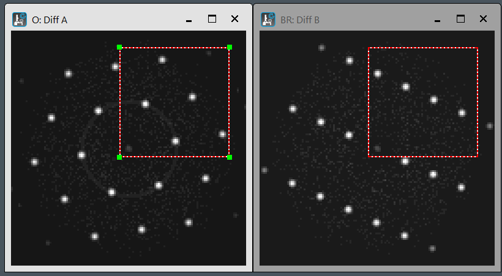
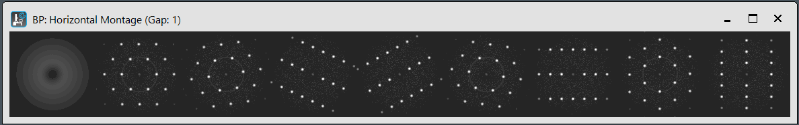
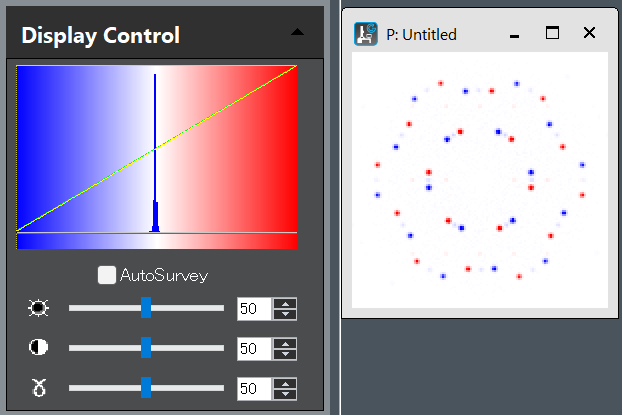
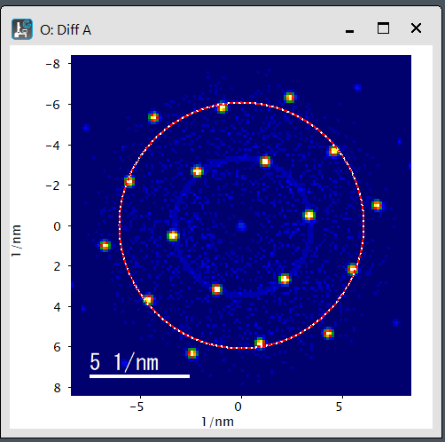
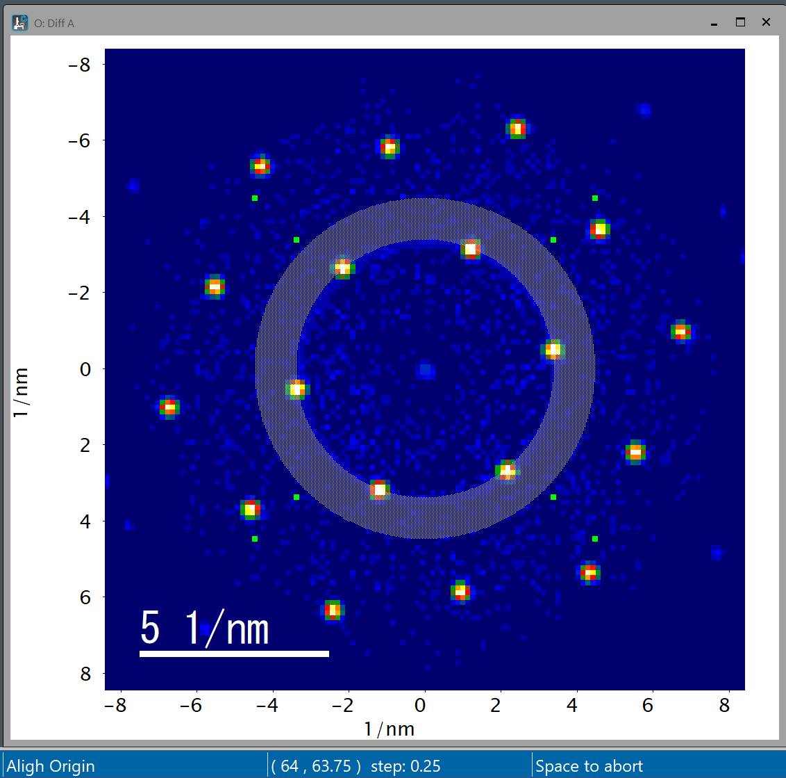
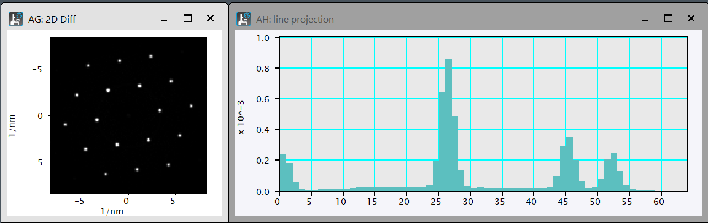
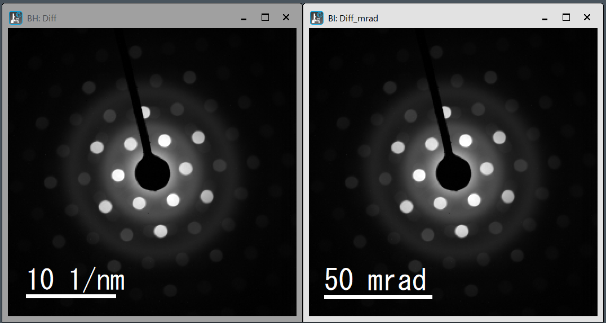

# DigitalMicrograph scripts  

- [DigitalMicrograph scripts](#digitalmicrograph-scripts)
  - [Display tools](#display-tools)
    - [Display aligned windows: AlignWindowHorV.s](#display-aligned-windows-alignwindowhorvs)
    - [ROI (rect) synchronized on two images: SyncRectOn2Img.s](#roi-rect-synchronized-on-two-images-syncrecton2imgs)
    - [Display 3D-slices as film roll: FilmRoll.s](#display-3d-slices-as-film-roll-filmrolls)
    - [Display in pseudo color: PseudoColorBlueWhiteRed.s](#display-in-pseudo-color-pseudocolorbluewhitereds)
    - [Display two images with same LUT: SameDisplaySetting.s](#display-two-images-with-same-lut-samedisplaysettings)
  - [Calibration tools](#calibration-tools)
    - [Copy calibration: snippet below](#copy-calibration-snippet-below)
    - [Coply image-tag: snippet below](#coply-image-tag-snippet-below)
    - [Save image-tag as .gtg file: snippet below](#save-image-tag-as-gtg-file-snippet-below)
    - [Save global-tag as .gtg file: snippet below](#save-global-tag-as-gtg-file-snippet-below)
    - [Diffraction centering using ROI: DiffOriginByROI.s](#diffraction-centering-using-roi-difforiginbyrois)
    - [Diffraction centering using Numpad: DiffOriginByNumpad.s](#diffraction-centering-using-numpad-difforiginbynumpads)
  - [Analysis tools](#analysis-tools)
    - [Offcentered rotational averaging: OffCentRotAve.s](#offcentered-rotational-averaging-offcentrotaves)
    - [Conversion 1/nm to mrad: nmInvTomrad.s](#conversion-1nm-to-mrad-nminvtomrads)
    - [Heatmap 3D  (in prep)](#heatmap-3d--in-prep)
    - [NMF using Scikit-Learn on DM  (in prep)](#nmf-using-scikit-learn-on-dm--in-prep)
  - [Experimantal tools](#experimantal-tools)
    - [EELS ZLP tracker\]: (in prep)](#eels-zlp-tracker-in-prep)
    - [Multiple STEM imaging: (in prep)](#multiple-stem-imaging-in-prep)


## Display tools  

### Display aligned windows: [AlignWindowHorV.s](scripts/AlignWindowHorV.s)    
２つのWindowを縦あるいは横に並べて表示。  
Display two windows side by side vertically or horizontally.  

### ROI (rect) synchronized on two images: [SyncRectOn2Img.s](scripts/SyncRectOn2Img.s)    
２つの画像に同じROI(Rectangle)を同期するように設定。1番上の画像のROIを参照にして2番目の画像にROIを配置・同期。同じ場所を切り出したい場合などに使用。  
Set the synchronized ROIs (rectangle) on the frontmost two images. Use the ROI on the top image as a reference to place and synchronize the ROI on the second image. It might be useful when you want to crop the same area.  



### Display 3D-slices as film roll: [FilmRoll.s](scripts/FilmRoll.s)  
3Dスタック画像を、縦あるいは横につなげて２次元表示。並べて観察したい場合、同じLUTで観察したい場合に。  
Display 3D images vertically or horizontally as a 2D film roll. For cases where you want to view them side by side or observe them using the same LUT.  


### Display in pseudo color: [PseudoColorBlueWhiteRed.s](scripts/PseudoColorBlueWhiteRed.s)  
決まった強度範囲を青－白－赤の疑似カラーで表示。  
Display a specified intensity range using blue-white-red pseudo-colors.  


### Display two images with same LUT: [SameDisplaySetting.s](scripts/SameDisplaySetting.s)  
一番上の画像と同じ表示条件(表示強度範囲やカラーテーブル)で、２番目の画像を表示。  
Display the second image using the same display conditions (display intensity range and color table) as the top image.  


  
## Calibration tools  

### Copy calibration: snippet below  

``` c++ 
// Copy Image>Calibration from image to image
image imgfrom, imgto
if(!GetTwoLabeledImagesWithPrompt("Select 'Source' and 'Target' images","Copy ALL Tags.", "from", imgfrom, "to", imgto)) exit(0)
ImageCopyCalibrationFrom(imgto, imgfrom)
```  

### Coply image-tag: snippet below  
``` c++
// Copy Image>Tags from image to image  
image imgfrom, imgto  
if(!GetTwoLabeledImagesWithPrompt("Select 'Source' and 'Target' images","Copy Image-Tags.", "from", imgfrom, "to", imgto)) exit(0)  
TagGroup SourceTags =ImageGetTagGroup(imgfrom)  
TagGroup TargetTags =ImageGetTagGroup(imgto)
TagGroupCopyTagsFrom(TargetTags, SourceTags)  
```  

### Save image-tag as .gtg file: snippet below
``` C++
// See and Save ImageTag as .gtg file
Image img := GetFrontImage()
TagGroup Itg = img.ImageGetTagGroup()
Itg.TagGroupOpenBrowserWindow( GetName(img) + "_tg", 0 ) 
if(!OkCancelDialog("Save this image tag?")) exit(0)
string path
SaveAsDialog("Save this global tags as .gtg", path, path)
TagGroupSaveToFile(Itg,path)
```  

### Save global-tag as .gtg file: snippet below  
``` c++
// How to See and Save Global Tag as .gtg
TagGroup Gtg =GetPersistentTagGroup( )
Gtg.TagGroupOpenBrowserWindow( "Global tags", 0 )
if(!OkCancelDialog("Save global tag?")) exit(0)
string path
if(!SaveAsDialog("Save this global tags as .gtg", path, path)) exit(0)
TagGroupSaveToFile(Gtg,path)
```


### Diffraction centering using ROI: [DiffOriginByROI.s](scripts/DiffOriginByROI.s)  
このscriptを使うと、ROIで回折図形の中心にpoint(+)をおいたり、あるいは同じ面間隔の回折スポットを通るようにoval(〇)を描き、原点を決めることができます。  
Using this script, you can place a point (+) at the center of the diffraction pattern within the ROI, or draw an oval (○) passing through diffraction spots with the same plane spacing to define the origin.  




### Diffraction centering using Numpad: [DiffOriginByNumpad.s](scripts/DiffOriginByNumpad.s)  

Originを少しずつ動かして確認。数字の4(左)、6(右)、8(上)、2(下)で、動くステップは+(2倍)、-(半分)、/で元のステップ値に戻し、スペースバーで決定。例えば、ROIのBand Pass tool(ドーナッツのようなマーク)をおいておくと、原点を中心とする円を描きますのでそれを見ながらスポット位置の調整が可能。  
Gradually move the origin to verify. For the numbers 4 (left), 6 (right), 8 (up), and 2 (down), the movement step is +(doubled), -(halved), or / to return to the original step value; press the spacebar to confirm. For example, if you place the ROI Band Pass tool (the doughnut-like icon), it draws a circle centered on the origin, allowing you to adjust the spot position while viewing it.     




  

## Analysis tools  

### Offcentered rotational averaging: [OffCentRotAve.s](scripts/OffCentRotAve.s)  
2次元画像を原点座標を中心に回転平均した1次元データを表示します。  
Rotatial averaged 1D of 2D image around the origin coordinates.  




### Conversion 1/nm to mrad: [nmInvTomrad.s](scripts/nmInvTomrad.s)  
通常、画像取得装置では、面間隔[nm]への変換が簡単になるように、回折図形は[1/nm]でキャリブレーションされています。一方、収束角などの実験条件は多くの場合には角度[mrad]で指定されています。しばしば実験条件を[mrad]で確認したいためこのscriptを作りました。加速電圧(V)によって波長(λ)が変わるため、散乱角2θと面間隔の逆数(1/d)との関係も変わります(2θ＝λ(V)/d)。そのため変換には加速電圧情報が必要です。通常の実験データでは加速電圧はimage tag（"Microscope Info:Voltage"）に保存されています。 次のscriptでは、[1/nm]を[mrad]に変換し、ファイル名に_mradをつけます(生データを間違って上書きしないようにするため)。加速電圧のtag情報が無い場合には、GetNumber()で入力を求めます。  
Diffraction patterns are often calibrated in [1/nm] to simplify conversion to lattice spacing [nm]. Meanwhile, experimental conditions are often specified in angular units [mrad]. This script converts [1/nm] to [mrad]. Since the wavelength (λ) changes with the accelerating voltage (V), the relationship between the scattering angle 2θ and the reciprocal of the lattice spacing (1/d) also changes (2θ = λ(V)/d). Therefore, the accelerating voltage is required for the conversion. The accelerating voltage of each experiment is usually stored in image tag (“Microscope Info:Voltage”). The script converts [1/nm] to [mrad] and appends _mrad to the filename (to prevent accidental overwriting of raw data). If the acceleration voltage tag information is missing, it prompts for input using GetNumber().  




### Heatmap 3D  (in prep)
３Dデータの各画像間の相互相関等をheatmap化  
Cosine similarity, Correlation coefficient, Maximum of cross correlationなどを表示

### NMF using Scikit-Learn on DM  (in prep)  
基本的な非負値行列因子分解(nonnegative matrix factorization, NMF)を、pythonライブラリ Scikit-learnを使って、DM上で実行します。
Primitive nonnegative matrix factorization (NMF) using Scikit-learn on DigitalMicrgraph.

## Experimantal tools  

### EELS ZLP tracker]: (in prep)  
### Multiple STEM imaging: (in prep)   


<!-- コメント

### Histogram (in prep)  
ヒストグラムを、所望の範囲とステップで作成。  

## Experimantal tools  

### EELS ZLP tracker (in prep)  
### Current tracker (in prep)    
### Drift tracker (in prep)   
### Multiple STEM imaging (in prep)   
### Drift correction by ROI tracking (in prep)
### Multiple TEM imaging (in prep)  

## Analysis tools  

### R-Phi U-V transformation (in prep)  
U-V to R-Phi (2D),  U-V to R-Phi (4D)  
R-Phi to U-V (2D),  R-Phi to U-V (4D)    

### Masking 4D (in prep)  
4Dデータに2Dデータでマスクをかける
    img4Dmasked(img4D, img2D)  
 
### Unfolding and refolding (4D<->2D) (in prep)    
 Matrix計算するためのunfoldingとrefolding。  
    img4Dto2D, img2Dto4D  
       


## Example Scripts Categories  
- Simple Image Computation
- Data Display
- Tags, TagGroups and TagLists
- ROIs
- Strings
- Annotations and Components
- Files
- Dialogs
- Objects and Interfaces
- Application Examples
- Further Examples
-->


<!-- 
図張り込みの３つの方法
1. Markdown
      

2. HTML
    
    

    <figure style="text-align: center;">
      
    <figcaption>　ここにキャプションを記載 </figcaption>
     </figure>

3. HTML div    
    <div style="text-align:center; color:grey">
     </br>
    *********************Caption***************************
    </div></br>

-->
