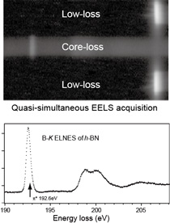
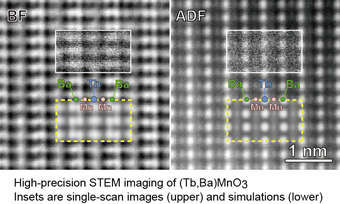
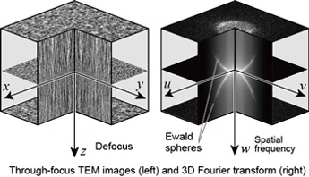
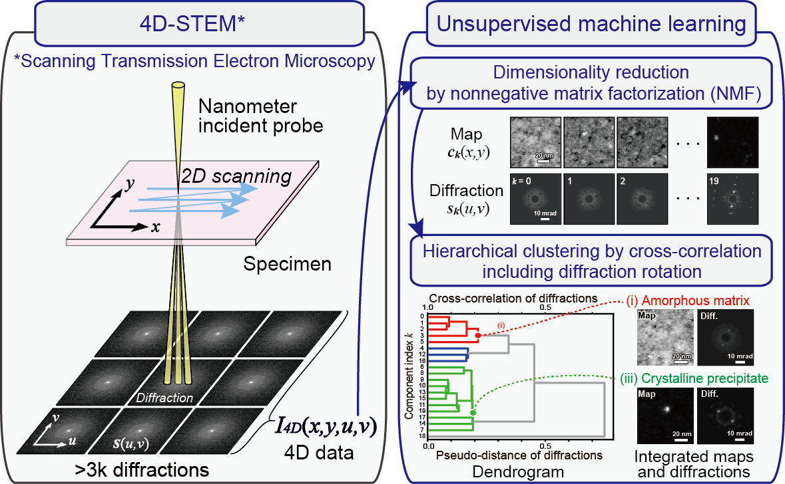

# DigitalMicrograph (DM) scripting for electron microscopy research  

Koji KIMOTO  

- [DigitalMicrograph (DM) scripting for electron microscopy research](#digitalmicrograph-dm-scripting-for-electron-microscopy-research)
  - [On electron energy-loss spectroscopy (EELS)](#on-electron-energy-loss-spectroscopy-eels)
  - [On STEM/TEM imaging](#on-stemtem-imaging)
  - [On machine learning for 4D-STEM](#on-machine-learning-for-4d-stem)

## On electron energy-loss spectroscopy (EELS)  
We published a paper entitled "Software Techniques for EELS..." in Journal of Microscopy (2002) [1], in which we improved practical energy resolution by "fast multiple acquisition and drift correction" technique. In addition, we demonstrated "low-loss and core-loss quasi-simultaneous acquisition" technique, which is similar to a Gatan's product, DualEELS, which was firstly released about ten years later.  
To my knowledge, we are the first authors who wrote DigitalMicrograph scripts on a scientific journal. The title of the paper firstly submitted was not "Software Technique" but "Script Enhancement", which was not accepted by a journal referee because "Script" was not a general word in 2002.  
"Fast multiple acquisition and drift correction" is a common strategy to realize inherent performance of the system [2]. The same kind of approach was performed in other papers, in which full-flame CCD read-out is used as a shutter of the camera [3,4].  

[1] [Kimoto and Matsui, J. Microsc. 208 (2002) 224](http://dx.doi.org/10.1046/j.1365-2818.2002.01083.x) : Some scripts are given in Appendix.  
[2] [Kimoto et al., J. Electron Microsc. 52 (2003) 299](http://jmicro.oxfordjournals.org/cgi/content/abstract/52/3/299): Al ELNES.       
[3] [Kimoto, Kothleitner, Grogger, Matsui and Hofer, Micron 36 (2005) 185](http://dx.doi.org/10.1016/j.micron.2004.11.001): Advantages of monochromator.  
[4] [Kimoto et al., Micron 36 (2005) 465](http://dx.doi.org/10.1016/j.micron.2005.03.008): 0.23eV resolution using CFEG.  

  
  
## On STEM/TEM imaging  
The procedure "fast multiple acquisition and drift correction" is also usable for TEM/STEM imaging, and we modified our scripts written for EELS in order to use them for STEM/TEM. We demonstrated the modified scripts in IMC meeting in Sapporo (2006), and published a few papers [5,6,7]. The scripts we prepared can improve not only the SN ratio but also the precision of the ADF imaging.  

[5] [Kimoto et al., Appl. Phys. Lett. 94 (2009) 041908](http://dx.doi.org/10.1063/1.3076110): Detection of single Eu dopant atom in SiAlON developed by Dr. Hirosaki (NIMS).  
[6] [M. Saito et al., J. Electron Microsc. 58 (2009) 131](http://dx.doi.org/10.1093/jmicro/dfn023): Detection of 10-pm atomic shift in (Tb,Ba)MnO3 synthesized by Prof. Kuwahara and Prof. Akahoshi.  
[7] [Kimoto et al., Ultramicroscopy 110 (2010) 778](http://dx.doi.org/10.1016/j.ultramic.2009.11.014): High-precision observation and its limit of ADF imaging.  

  

Now DigitalMicrograph scripting is common as a research activity. For instance we prepared several scripts for 4D-STEM. in which 4D data was converted to various 3D datasets [8]. Quantitative ADF imaging implements probe current monitoring and the conversion of the non-linear response of the STEM detection systems [Yamashita et al. in print]. Since a multiple acquisition corresponds to a time dependence, we can elaborate a dynamic behavior of the material [9]. Multiple TEM acquisition is also useful for observing beam-sensitive materials [10].  
Our first attempt to perform the assessment of TEM performance [11][12] was made using 3D Fourier transform, which was an in-house script, although now 3D Fourier transform is a standard function of DigitalMicrograph.  

[8] [Kimoto and Ishizuka, Ultramicroscopy 111(2011) 1111](http://dx.doi.org/10.1016/j.ultramic.2011.01.029): Spatially-resolved diffractometry with atomic-column resolution.    
[9] [Haixin Chang, et al., Scientific Reports 4 (2014) 6037](http://dx.doi.org/10.1038/srep06037): Single adatom dynamics on a reduced graphene.    
[10] [M. Ohwada et al. Scientific Reports 3 (2013) 2801](http://dx.doi.org/10.1038/srep02801): TiO2 nanosheet with Ti vancancy  
[11] [Kimoto et al. Ultramicroscopy 121 (2012) 31](http://dx.doi.org/10.1016/j.ultramic.2012.06.012): Assessment of lower-voltage TEM performance using 3D Fourier transform of through-focus series.  
[12] [Kimoto, Sawada, Sasaki, Suenaga, Ishizuka et al. Ultramicroscopy 134 (2013) 86](http://dx.doi.org/10.1016/j.ultramic.2013.06.008): Quantitative evaluation using 3D Fourier transforms of through-focus TEM images  

  
  
## On machine learning for 4D-STEM  
We can treate the obtained measurement data as big data and we combined 4D-STEM with unsupervised machine learning [13]. While principal component analysis (PCA) is widely used for dimensionality reduction, we use nonnegative matrix factorization (NMF). While PCA is a representative method for feature extraction from multidimensional data, it has the issue that elements containing negative values cannot be interpreted as diffraction. NMF has higher computational cost and may converge to local minima, but it provides interpretable results, making it suitable for experimental data analysis. We firstly apply NMF to 4D-STEM, in which we prepared DM scripts for NMF from scratch [13]. We applied NMF and hierachical clustering for annealed metallic glass ZrCuAl [14] and monolayer MoS2 [15].  
There are a few known artefacts in primitive NMF. We therefore incorporated electron microscopic knowledge in NMF algorithm [16].  

[13] [Uesugi, Kimoto et al. Ultramicroscopy 221(2021) 113168](https://doi.org/10.1016/j.ultramic.2020.113168): First NMF application for 4D-STEM.  
[14] [Kimoto et al. Scientific Reports 14(2024) 2901](https://doi.org/10.1038/s41598-024-53289-5): NMF and clustering of annealed metallic glass ZrCuAl.  
[15] [Kimoto et al. Small Methods 9(2025)e01065](https://doi.org/10.1002/smtd.202501065): Application for monolayer MoS2.  
[16] [Kimoto et al. Scientific Reports 15(2025) 39143](https://doi.org/10.1038/s41598-025-23541-7): Constrained NMF incorporating electron microscopic knowledge.  

  

<!-- 
図張り込みの３つの方法
1. Markdown
      

2. HTML
    
    
    

    <figure style="text-align: center;">
      
    <figcaption>　ここにキャプションを記載 </figcaption>
     </figure>

3. HTML div    
    

      
    *********************Caption***************************
    
 

-->